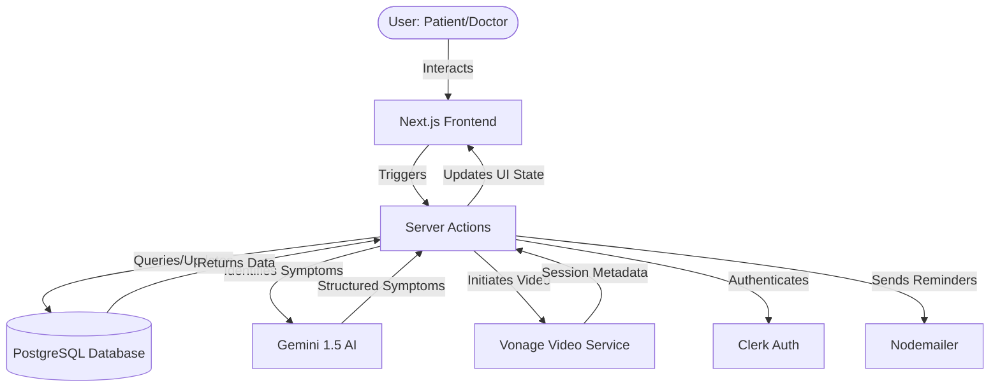
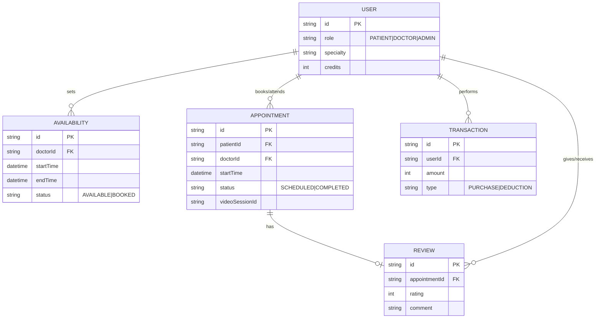

# 🩺 DocMeet - Modern Doctor Appointment & Consultation Platform

DocMeet is a premium, full-stack healthcare platform designed to bridge the gap between patients and medical professionals. Built with the latest tech stack (Next.js 15, Prisma, Gemini AI, and Vonage), it offers a seamless experience for scheduling, AI-powered symptom triage, and high-quality video consultations.

---

## 🚀 Objectives
- **Accessibility**: Make healthcare consultations available from anywhere with integrated video conferencing.
- **Intelligence**: Leverage Generative AI (Gemini) and selfmade Machine Learning Model to provide preliminary symptom analysis and triage.
- **Security**: Ensure patient data privacy and secure authentication through industry-standard providers.
- **Efficiency**: Streamline the booking process with automated availability management and credit-based payments.

---

## 🛠️ Technology Stack

| Category | Technology | Why we used it? |
| :--- | :--- | :--- |
| **Framework** | **Next.js 15** | For Server-Side Rendering (SSR), efficient routing (App Router), and performance. |
| **Database** | **PostgreSQL (Prisma)** | For structured data management and type-safe database queries. |
| **Auth** | **Clerk** | To handle user authentication, roles, and identity management securely. |
| **AI** | **Google Gemini** | To power symptom extraction and intelligent medical triage. |
| **Video** | **Vonage Video API** | For reliable, low-latency, and HIPAA-compliant video consultations. |
| **Styling** | **Tailwind CSS 4** | For rapid development of a modern, premium UI with clean design tokens. |
| **Animations** | **Framer Motion** | To implement smooth micro-animations and glassmorphism effects. |
| **Mailing** | **Nodemailer** | For automated appointment reminders and verification emails. |

---

## 📂 Project Structure

```bash
├── actions            # Next.js Server Actions (CRUD, Logic)
├── app                # App Router (Pages, API Routes, Layouts)
│   ├── (auth)         # Authentication routes
│   ├── (main)         # Main application features (Doctors, Appointments)
│   └── api            # Backend endpoints (Webhooks, etc.)
├── components         # Reusable UI components (Shadcn UI, Custom)
├── hooks              # Custom React hooks
├── lib                # Utilities (AI, Prisma client, Mail utilities)
├── prisma             # Database schema and migrations
├── public             # Static assets (Images, Icons)
└── middleware.js      # Clerk auth and role-based access control
```

---

## 🔄 System Flow
1. **Onboarding**: Users sign up via Clerk and choose their role (**Patient** or **Doctor**).
2. **Setup**: Doctors configure their availability slots and medical specialties.
3. **Search & Triage**: Patients can use AI-powered triage to describe symptoms or search for doctors directly by specialty.
4. **Booking**: Patients book appointments using a credit-based system (Credits purchased via integrated payments).
5. **Consultation**: At the scheduled time, both parties join a secure video session powered by **Vonage**.
6. **Closing**: Once complete, appointments are marked as finished, and patients can leave reviews.

---

## 📊 Data Flow Diagram (DFD)



---

## 🧬 Entity Relationship (ER) Diagram



---

## 🛠️ How to Run Locally

1. **Clone the Repo**:
   ```bash
   git clone https://github.com/Rehan0013/DocMeet.git
   ```
2. **Install Dependencies**:
   ```bash
   npm install
   ```
3. **Setup Environment Variables**:
   Create a `.env` file and add keys for Clerk, Prisma (DATABASE_URL), Google Gemini, and Vonage.
4. **Prisma Setup**:
   ```bash
   npx prisma generate
   npx prisma db push
   ```
5. **Run Dev Server**:
   ```bash
   npm run dev
   ```

---

*Made with ❤️ for advanced healthcare.*
